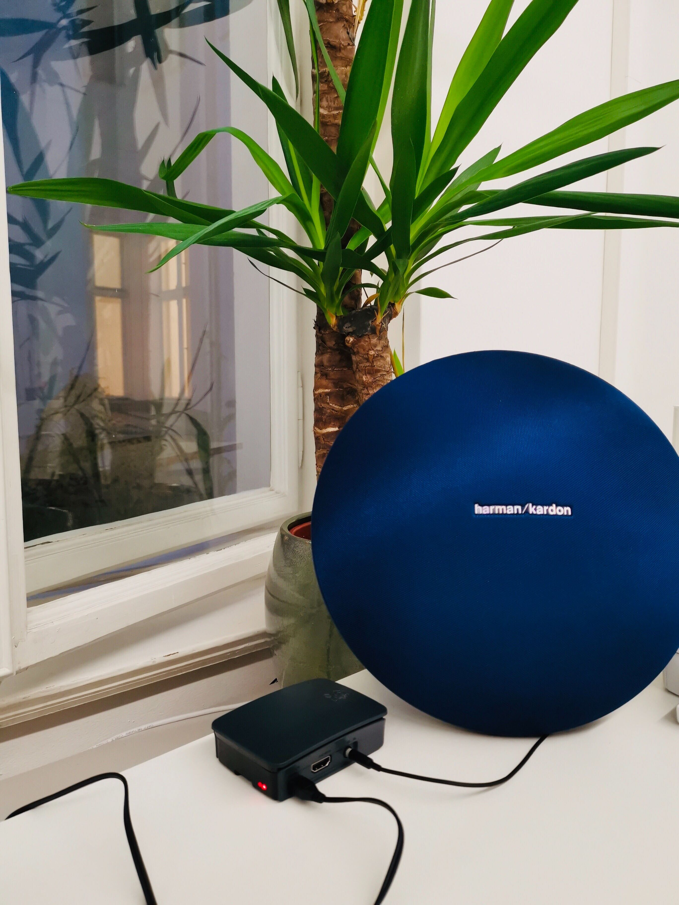

# Canairy
"You don’t smell it, you don’t see it, but when the canary falls off the perch, there’s something wrong with your airflow!" - Just like the workers in the coal mines, that used canaries to be warned of deadly gases, you can use the animals in your modern workspaces - No bird will be hurt, we promise! 

## About

Canairy is an open source application provided to you to coordinate your airing and prevent viruses from spreading within your team. To solve the problem every company is currently facing we use "Apache Airflow", a workflow management platform that is on everyones lips when it comes to the productive and sustainable development of AI.

Just install the software on a Raspberry Pi, set the times of your "airflow" according to your individual conditions and be reminded regularly to air your place! How? Let the canary sing.

Join in, bring airflow into your environment and help us develop the next level with integrated CO2 sensors. We’re excited about your ideas!

## Project Setup

### Requirements
1. Raspberry Pi with Raspbian OS installed, Internet connection, HDMI monitor with cable, keyboard, mouse
2. Docker
3. Connected audio device

### RaspberryPi Setup
We used [this](https://www.amazon.de/UCreate-Raspberry-Pi-Desktop-Starter/dp/B07BNPZVR7/) Raspberry 3 Model B+.
Just assemble the case, put in the Micro SD card, connect a Monitor, keyboard and mouse and power the device on.

Connect to a WIFI when prompted. Changing the other settings is not necessary. We however recommend not to skip the software updates, even though they take some time.

### Installing Docker on Raspbian
We followed [this](https://phoenixnap.com/kb/docker-on-raspberry-pi) guide.

From the terminal run:

1. `sudo apt-get update && sudo apt-get upgrade` to update your software
2. `curl -fsSL https://get.docker.com -o get-docker.sh` to download the install script
3. `sudo sh get-docker.sh` to run the install script.
4. `sudo usermod -aG docker pi` to add the `pi` user to the docker group, to allow it to run docker commands

If your installation worked, `docker version` will show you the installed docker version.

**Restart your Raspberry now.**

### Connect Audio Device
Connect any speakers you want to the AUX Audio Output of the Raspberry Pi.

## Installing Canairy
There are two options to get the Docker image.
1. From Docker Hub
2. Building it from GitHub sources

### From Docker Hub
From the terminal run `docker pull birdsonmars/canairy:v1`

### Building it from GitHub
From the terminal:
1. With `cd <directory>` move to the desired target directory
2. Clone this repository onto the Raspberry Pi: `git clone git@github.com:birds-on-mars/canairy.git`
3. Go to the project folder: `cd canairy`
4. Build the image: `docker build --rm -t canairy:v1 .` (this step might take quite long, up to several hours)

## Starting Canairy
Run `docker run -it --device /dev/snd -p 8080:8080 --name canairy --restart unless-stopped <image name>`
Replace `<image name>` with `birdsonmars/canairy:v1` if you pulled from Docker Hub or with the name you chose with the `-t` flag if you have built the image yourself (eg `canairy:v1`)

- The `--device /dev/snd` flag provides the docker container with access to the audio device.
- The `-p 8080:8080` forwards port 8080 from the host to port 8080 of the docker container (where airflow is running). Change the first port however you like if needed.
- `--name canairy` (optional) defines the name of the container. Change it as you like.
- `--restart unless-stopped` will restart the docker container after rebooting the Raspberry Pi. To stop it run `docker stop <container ID or name>`. You can get the ID or name with `docker ps`.
- `<image name>` is the name if the docker image to start

The Docker container is now running in the terminal and will always restart if closed or after rebooting the Raspberry Pi, until you stop it with `docker stop <container ID or name>` (get the ID with `docker ps`).
We will use that to make sure the correct sound device is used. Depending on the Raspberry Pi Model, the Docker container might play sounds to the HDMI device while a monitor is connected. You can listen to these sounds by connecting your audio device to the HDMI monitor audio output. To get sounds from the standard audio jack output, disconnect the HDMI device and restart the raspberry pi by unplugging and replugging the power plug. This starts the raspberry pi in the so-called "headless mode".

### Changing the config and sound file
To load your own config and/or sound file(s) into the docker container you need to have a folder containing the config.yml and/or sound file you want to use.

Mount it to the docker container on startup by adding the following flag to the run command: `-v <path to folder>:/usr/local/airflow/dags/mount`
#### config.yml
To change any settings copy the `config.yml` from the GitHub repository and change any values you want.

#### Sound File(s)
The sound file we use is from [here](https://freesound.org/people/ReadeOnly/sounds/85402/) and included alternatives are from [here](https://freesound.org/people/ReadeOnly/sounds/85404/) and [here](https://freesound.org/people/Lydmakeren/sounds/510906/), all converted to mp3.

To use different sounds for the open and close reminder, or another sound in general, add it to the folder you will be mounting to the docker container. Change the values `start_file` and `end_file` in the `config.yml` to match the name(s) of your sound file(s). As by now only mp3 files are supported.

## Contact
Please contact [Klaas](mailto:klaas@birdsonmars.com) or [Nico](mailto:nico@birdsonmars.com) for any questions.

## License
Canairy is licensed under the Apache License, Version 2.0. See [LICENSE](LICENSE) for the full license text.
